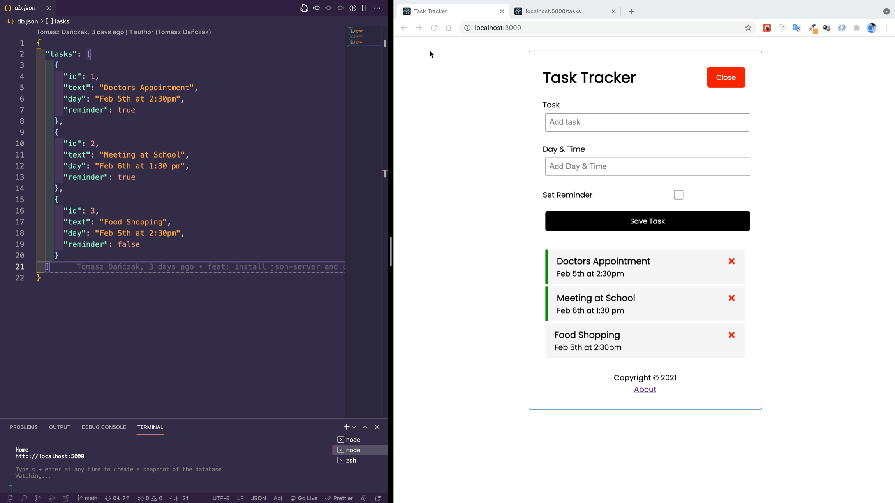

# 🌱 This is my work with [React JS Crash Course 2021](https://www.youtube.com/watch?v=w7ejDZ8SWv8) by Traversy Media

### 🚀  [See live](https://tomaszdanczak.github.io/traversy-media-react-crash-2021/)

## Stack
- React (useState, useEffect, defaultProps, propTypes, map, delete, add and update data in state)
- Axios (load data from DB, delete, add and update data in DB)
- localStorage (load data from localStorage, delete, add and update data in localStorage)
- JSON Server
- react-router-dom
- React-Icons
- Fetch

## Things I did myself
- In version hosted on Github I created logic of using localStorage
- In local version of the project I used axios instead Featch api
- I saved apiEndpoint in config.json file and use it from there
- I rebuilt functions (I think changes I did makes this functions more clearly)
- gh-pages (I used process.env.PUBLIC_URL)
